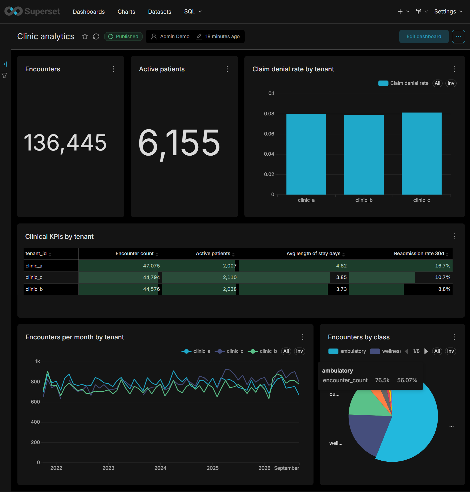

# Federated Clinic Data Harmonization PoC

[](https://github.com/AlexBormotov/trino-showcase/actions/workflows/ci.yml)

A small-scale proof of concept of a federated data and semantic layer for a multi-tenant healthcare platform. Three synthetic "client clinics" keep the same business entities (patients, encounters, diagnoses, claims) in different databases, each with its own column names, formats, schema versions and gaps in five years of history. Nothing is copied into a central store: Trino reads the data in place, dbt maps it to one canonical model as views, and business metrics are defined once in Apache Ossie (ex-Open Semantic Interchange), from which MetricFlow and Superset get generated definitions. Trino also enforces security: each analyst sees only their tenant, PHI is masked, and every query is audited. Each layer is tested against the clean source truth that the data generator recorded.

> Status: MVP complete. CI brings the whole stack up from scratch on every push and runs dbt plus 85 tests. Scope and decisions: [docs/PLAN.md](docs/PLAN.md) and [docs/adr/](docs/adr/); metric definitions: [docs/metrics.md](docs/metrics.md).

**Stack:** Trino · PostgreSQL · MySQL · Apache Iceberg · Apache Polaris · RustFS · dbt-trino · dbt MetricFlow · Apache Ossie · Superset · sqlglot · Python (uv) · Synthea · Docker Compose · GitHub Actions

## Architecture

```
 Synthea (in a container)
   │  CSV: patients, encounters, conditions, claims (clean synthetic data)
   ▼
 seed/build.py   splits patients across 3 tenants, injects real-world drift,
   │             writes data/manifest.json (clean truth + what was injected)
   ▼
 seed/load.py
   ├── clinic_a ──► PostgreSQL  (schemas app_v1, app_v2)              COPY
   ├── clinic_b ──► MySQL       (camelCase, soft deletes)              INSERT
   └── clinic_c ──► Iceberg     (Parquet on RustFS, Polaris catalog)   PyIceberg → REST
                       │
                       ▼
 Trino 483   catalogs pg_clinic_a, mysql_clinic_b, iceberg, audit
   │         + access rules (rules.json) + query audit (MySQL event listener)
   ▼
 dbt-trino   all models are views, stored in Polaris as Iceberg views
   staging/     one view per source table and schema version: translation to canonical names and types
   canonical/   patient (SCD2), encounter, diagnosis, claim = UNION ALL over tenants
   marts/       fct_encounter, fct_claim, dim_patient: row-level flags for metrics
   │
   ▼
 semantic/clinic_analytics.yaml   ← the only place metrics are defined (Ossie)
   ├── semantic/compile.py       → target/semantic_manifest.json → MetricFlow (mf query) → Trino
   └── semantic/superset_sync.py → Superset datasets, metrics, dashboard → Trino, as the viewer
```

## How it works

### 1. Sources and federation

Synthea 4.0 generates realistic patients in a throwaway Java container with a fixed seed and reference date, so every run produces the same data. `seed/build.py` (pure pandas, unit-tested) cuts a five-year window, assigns patients to tenants by a hash of their id, and makes each tenant look like a different legacy system:

| Tenant | Store | Deliberate drift |
|---|---|---|
| `clinic_a` | PostgreSQL | Two schema versions: `app_v1` until 2024 (dates as `DD.MM.YYYY` strings, other column names, gender `1/2`) and `app_v2` after. Address history as a CDC log |
| `clinic_b` | MySQL | camelCase names; duplicate visits soft-deleted with `isDeleted = 1`; amounts in **cents until 2023-07-01** and in dollars after, in the same column; local diagnosis codes with a dictionary to SNOMED; no history |
| `clinic_c` | Iceberg on RustFS | Archive partitioned by month with three months missing; codes prefixed `SNOMED:`, 5% of diagnoses with text only; claims of the lost encounters remain as orphans |

Claim statuses are spelled differently in each tenant (`P/D/O`, `PAID/DENIED`, `approved/rejected`, `paid/denied`). Synthea closes every claim, so the seeder injects about 8% denials.

Trino reaches the sources over JDBC (PostgreSQL, MySQL) and Iceberg REST plus S3 (Polaris, RustFS). Polaris stores its metadata in PostgreSQL; RustFS replaces MinIO, whose repository is archived. Compose health checks order the bootstrap: Polaris realm and bucket first, then Polaris, then catalog setup, then Trino. Every step is idempotent. Filters and `count(*)` on PostgreSQL and MySQL are pushed down whole (visible in `EXPLAIN`). [ADR 0001](docs/adr/0001-iceberg-catalog-and-object-storage.md)

### 2. Canonical model (dbt-trino)

- **Staging** has one view per source table and schema version. It renames columns, fixes types and applies shared macros (`parse_dmy_ts`, `gender_code`, `cents_to_amount`, `strip_code_prefix`, `hash_key`). Tenant-specific logic lives only here.
- **Canonical** is a `UNION ALL` of staging with Data-Vault-style hash keys (`patient_hk = md5(tenant_id | patient_id)`), stable and unique across tenants.
- **SCD2 on patient address**: `clinic_a` versions are replayed from its CDC log; tenants without history get one open version.
- **Everything is a view** stored in Polaris, so nothing is written to tenant databases: federation first, materialize by exception. A `tenant_id` filter prunes the union to a single source; the cents-to-dollars `CASE` blocks aggregate pushdown and is the first materialization candidate. [ADR 0002](docs/adr/0002-canonical-model-as-federated-views.md)

### 3. Semantic layer (Ossie → MetricFlow)

Five metrics live in `semantic/clinic_analytics.yaml`: `encounter_count`, `active_patients`, `avg_length_of_stay_days`, `readmission_rate_30d`, `claim_denial_rate` ([catalog](docs/metrics.md)). Row-level facts the metrics need, such as the 30-day readmission flag, are dbt marts, because Ossie expressions aggregate fields of one row and cannot look across rows.

`uv run poe semantic` runs `dbt parse` and then `semantic/compile.py`. The official Ossie converter (pinned to an apache/ossie commit, not on PyPI) turns the YAML into `target/semantic_manifest.json`, and the script fills its gaps: the time spine and the default time dimension. `mf query` then reads that manifest and runs SQL on Trino. [ADR 0003](docs/adr/0003-ossie-as-metric-source.md) lists the converter gaps found along the way.

### 4. Security

Trino enforces everything for every consumer (`infra/trino/rules.json`, deny by default):

| User | Sees | Rows | PHI |
|---|---|---|---|
| `admin` | everything | all | raw |
| `cross_tenant_analyst` | `canonical`, `marts`, the time spine | all tenants | masked |
| `tenant_a_analyst` | same | `clinic_a` only | masked |
| anyone else | nothing | – | – |

- **Masks:** names and address become `***`, SSN and source patient id are hashed, birth date keeps the year, ZIP keeps three digits.
- **No bypass:** analysts have no access to the source catalogs or staging, and the models are `SECURITY DEFINER` views.
- **Read-only sources:** Trino reads PostgreSQL and MySQL as read-only users.
- **Audit:** a MySQL event listener records every query, including denied ones, with the physical tables it read. That record shows that a `tenant_a_analyst` query on the shared union touches only PostgreSQL: isolation is physical, not only logical.

Known gaps (no authentication, unsalted hashes, storage keys outside Trino) are recorded in [ADR 0004](docs/adr/0004-access-control-and-audit.md).

### 5. BI (Superset)

`uv run poe superset` publishes the Ossie model through Superset's REST API: one Trino connection, a dataset per Ossie dataset, metrics translated to Trino SQL with sqlglot, six charts and a dashboard. Reruns change nothing. The translation drops dataset qualifiers, casts ratios to `DOUBLE` with `NULLIF`, and rejects cross-dataset metrics. The connection impersonates the logged-in user, so the same dashboard shows `tenant_a_analyst` only clinic_a with PHI masked. [ADR 0005](docs/adr/0005-superset-from-ossie.md)



<!-- To add: the same dashboard logged in as tenant_a_analyst -->

### 6. Tests and CI

A check never repeats the logic it checks:

| Checked | Against |
|---|---|
| Source loads | Row counts the seeder wrote, from `data/manifest.json` |
| Canonical model | The manifest's `expected` block: truth computed from clean Synthea data **before** drift. The model must recover it: cents back to dollars, soft-deleted duplicates dropped, gender codes unified |
| Archive orphans | The manifest's `injected` counts, exactly |
| Readmission flag | The same rule written differently (`EXISTS` instead of a grouped join) |
| MetricFlow metrics | The manifest, or SQL over the canonical model that bypasses marts and MetricFlow |
| Superset metrics | `mf query`, per tenant |
| Security | Queries as each role, bypass attempts, the audit log |
| Ossie ↔ MetricFlow | Round-trip conversion |

Every stage was also given a negative control: break the rule, see exactly the expected tests fail, restore it. The cross-checks caught real bugs. One was overlapping inpatient stays that made a `lead()`-based readmission flag miss 61 readmissions.

`.github/workflows/ci.yml` runs the whole sequence below on every push, with 300 synthetic patients instead of 6,000 (about 7 minutes).

## Run it locally

### Requirements

- **Docker** with Compose v2 (Docker Desktop on Windows and macOS). The containers are capped at about 7.5 GB of memory in total; give Docker at least 8 GB. Images take about 6 GB of disk.
- **[uv](https://docs.astral.sh/uv/)**. It installs Python 3.12 and every dependency, including dbt, MetricFlow and the Ossie converter.
- **git** and internet access on the first run: images, the 200 MB Synthea jar, and the Ossie converter from GitHub.
- Java is not needed: Synthea runs in a container.

### Commands

```bash
git clone https://github.com/AlexBormotov/trino-showcase.git
cd trino-showcase
uv sync                         # Python 3.12 environment from uv.lock

uv run poe up                   # start the stack and wait until healthy (first run builds Superset)
uv run poe synthea              # generate 6,000 patients (~5 min); or quicker: uv run python -m seed.synthea 300
uv run poe seed                 # build the three tenants, write data/manifest.json, load PostgreSQL, MySQL, Iceberg
uv run dbt build                # staging, canonical and marts views + dbt tests
uv run poe semantic             # Ossie -> target/semantic_manifest.json for MetricFlow
uv run poe superset             # Ossie -> Superset datasets, metrics, charts, dashboard

uv run pytest                   # all tests (integration tests need the steps above)
uv run pytest tests/unit        # unit tests only, no stack needed
```

Explore:

```bash
uv run mf query --metrics encounter_count,readmission_rate_30d --group-by encounter__tenant_id
uv run mf query --metrics claim_denial_rate --group-by patient__gender
docker compose exec trino trino --user tenant_a_analyst   # the data as an analyst sees it
docker compose exec trino trino --user admin              # everything, including the audit catalog
```

Superset is at http://localhost:18088. Log in as `admin` / `admin`, or as `tenant_a_analyst` / `tenant_a_analyst` to see the same dashboard filtered and masked.

Stop with `uv run poe down`. To also drop all data, run `uv run poe reset`.

| Service | Host port |
|---|---|
| Trino | 18080 |
| Superset | 18088 |
| PostgreSQL | 15432 |
| MySQL | 13306 |
| Polaris | 18181 (management 18182) |
| RustFS | 19000 (console 19001) |

All ports are bound to `127.0.0.1` and all credentials are throwaway local values. Trino has no authentication, so do not expose the stack to a network.

On a Windows console, set `PYTHONIOENCODING=utf-8` before running `mf` directly: it prints characters that cp1251 cannot encode. The `poe` tasks already set it.

## Repository layout

| Path | Contents |
|---|---|
| `docker-compose.yml`, `infra/` | Stack; Trino catalogs, access rules and audit; Polaris setup; database init scripts; tenant DDL; Superset image |
| `seed/` | Synthea runner; tenant builder with drift injection; loaders |
| `models/`, `macros/`, `tests/dbt/` | dbt staging, canonical and marts models; transform macros; singular tests |
| `semantic/` | Ossie model; MetricFlow compilation; Superset sync |
| `tests/unit/`, `tests/integration/` | pytest |
| `docs/` | Plan, ADRs, metric catalog; `docs/obsidian/` is an Obsidian vault (open the folder as a vault for Graph View) with a note per area and per source file |

## Beyond the MVP

Planned for v2:

- a metadata-driven mapping registry (`mappings/<tenant>.yml`) that generates staging models, with N tenant schemas from one template, to show how this scales to hundreds of clients;
- schema drift detection and profiling over `information_schema` of every catalog;
- `provider` as a canonical entity.

Hardening, from ADR 0004:

- authentication in Trino (TLS, then password, then OAuth2/SSO with tenant groups);
- OPA or Apache Ranger instead of the rules file;
- a keyed HMAC instead of plain hashes.

### Starburst

Starburst (Enterprise or Galaxy) is the commercial Trino distribution. The SQL, the dbt-trino project and the canonical views carry over unchanged. The gains are operational:

- **Access control.** Starburst built-in access control or the Apache Ranger integration replaces the PoC's file-based `rules.json`. Row filters on `tenant_id` and PHI column masks become managed policies with an admin UI, role inheritance and change history, instead of a file in Git.
- **Performance on federated sources.** Warp Speed (smart indexing and caching) and materialized views with refresh schedules cover the "federation first, materialize by exception" trade-off without hand-built Iceberg tables.
- **More connectors and better pushdown.** Enterprise connectors for SQL Server, Oracle and others widen the range of client databases that can be federated. Parallel reads from relational sources speed up large historical scans.
- **Catalog, lineage and audit.** Starburst catalog and query history give data discovery, column-level lineage and a central audit trail. The PoC builds these from dbt docs and a Trino event listener.
- **Data products.** Canonical and semantic datasets can be published as governed data products with owners and descriptions.

### AWS Lake Formation

Lake Formation fits the part of the platform that lives on S3. In the PoC that is the archive tenant `clinic_c`, and it would also cover any canonical tables materialized to Iceberg.

- **Catalog.** Replace the PoC's Polaris REST catalog with the AWS Glue Data Catalog, either through Glue's Iceberg REST endpoint (the same catalog protocol the PoC uses) or with `iceberg.catalog.type=glue`. Athena reads the same tables.
- **Fine-grained permissions.** Lake Formation grants at database, table, column and row level (data filters), with LF-Tags for tag-based access control. Example: tag PHI columns `phi=true` and tag tables `tenant=clinic_c`, then grant per analyst role by tag.
- **Enforcement across engines.** Athena, Redshift Spectrum and EMR enforce Lake Formation permissions natively. For Trino the options are Starburst's Lake Formation integration, or keeping Trino-side rules in sync with LF grants. The trade-off is one policy store for S3 data versus a second one for the relational sources Lake Formation does not cover. That is worth an ADR.
- **Audit.** Lake Formation data access events go to CloudTrail, which helps with PHI access audit requirements.
- **Tenant isolation at scale.** With 1,200+ tenants, LF-Tags scale better than per-table grants: one tag value per tenant and one grant per role pattern.

## How this project was built

Development used Claude Code under the rules of an AI Factory kit ([what an AI factory is](https://www.3alica.com/blog/what-is-an-ai-factory)). The kit is a method for running coding agents on evidence rather than on trust: an agent's work counts as done only when an independent check passes, and the amount of autonomy a loop gets depends on how good that check is.

In this project it shaped three things:

- **Design review before code.** The plan was stress-tested in rounds of questions with recommended answers before any code was written. The decisions it produced are recorded in [docs/PLAN.md](docs/PLAN.md).
- **Checks as the definition of done.** Every stage ends with a runnable check (`dbt build`, pytest for row and column security, seed-manifest counts, metric parity between MetricFlow and Superset), and CI runs them from a clean stack.
- **Small scoped changes with second opinions.** Changes stay within one stage, and design questions can be sent to models from other vendors for an independent read-only review.

The kit's files are not part of this repository.
